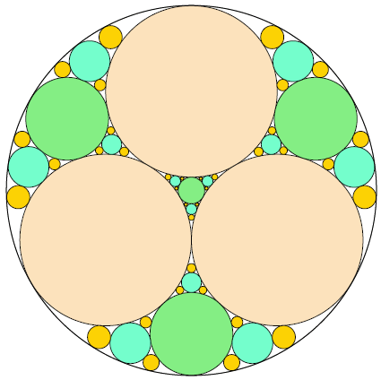

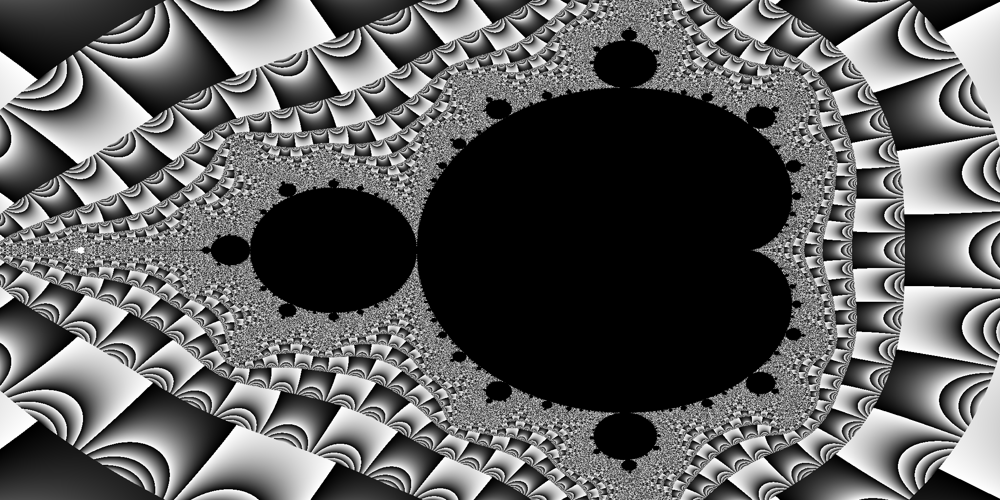

# Programming M2 2017-2018

## Setup

For the finals, you will **have** to put your code under:

- `$HOME/M_<username>/go/src/uca.fr/<username>`

To make sure everything is correctly setup:

```
$> export GOPATH=$HOME/M_username/go
$> go get github.com/master-pfa-info/exams/2017-2018/m2/setup-pfa-exam
$> $GOPATH/bin/setup-pfa-exam -init
```

(replace `M_username` with the correct directory name.)

At the end of the finals, you'll have to run:

```
$> $GOPATH/bin/setup-pfa-exam -save
```

and send the resulting file to `binet@cern.ch`.

## ROT-13 (5 pts)

We saw during the lectures that Caesar had devised a scheme to crypt his important
messages.
The procedure is known as _Caesar's_ _Cipher_, or _"rotate by 13 places"_ (_a.k.a_ `ROT13`.)

During the lectures we saw how to create an `io.Reader` that would encrypt a message
with this scheme.

For this exercize, you will have to implement an `io.Writer` that encrypts a message
with this scheme.

- Create a `package rot13` under `$GOPATH/src/uca.fr/<username>/rot13`
- Create a command (`package main`) under `$GOPATH/src/uca.fr/<username>/rot13/cmd/rot13`

The `rot13` package will hold the implementation of the `io.Writer` that performs the
message encryption.
The `rot13` command will look like:

```
package main

import (
    "io"
    "os"
    
    "uca.fr/<username>/rot13"
)

func main() {
    w := rot13.NewWriter(os.Stdout)
    _, err := io.Copy(w, os.Stdin)
    if err != nil {
        panic(err)
    }
}
```

## Multiples (5 pts)

If we list all the natural numbers below 10 that are multiples of 3 or 5, we get 3, 5, 6 and 9. The sum of these multiples is 23.

Find the sum of all the multiples of 3 or 5 below 1000.

Put your (compiling) code under: `$GOPATH/src/uca.fr/<username>/mult`.

## Fibonacci (5 pts)

Each new term in the Fibonacci sequence is generated by adding the previous two terms. By starting with 1 and 2, the first 10 terms will be:

```
1, 2, 3, 5, 8, 13, 21, 34, 55, 89, ...
```

By considering the terms in the Fibonacci sequence whose values do not exceed four million, find the sum of the even-valued terms.

Put your (compiling) code under: `$GOPATH/src/uca.fr/<username>/fib`.

## Ant and seeds (5 pts)

A laborious ant walks randomly on a `5x5` grid.
The walk starts from the central square.
At each step, the ant moves to an adjacent square at random, without leaving the grid;
thus there are 2, 3 or 4 possible moves at each step depending on the ant's position.

At the start of the walk, a seed is placed on each square of the lower row.
When the ant isn't carrying a seed and reaches a square of the lower row containing a seed,
it will start to carry the seed.
The ant will drop the seed on the first empty square of the upper row it eventually reaches.

What's the expected number of steps until all seeds have been dropped in the top row? 
Give your answer rounded to 6 decimal places.

Put your (still compiling) code under: `$GOPATH/src/uca.fr/<username>/ants`.

## Black & White (5 pts)

An ant moves on a regular grid of squares that are coloured either black or white.
The ant is always oriented in one of the cardinal directions (left, right, up or down) and moves from square to adjacent square according to the following rules:

- if it is on a black square, it flips the color of the square to white, rotates 90 degrees counterclockwise and moves forward one square.
- if it is on a white square, it flips the color of the square to black, rotates 90 degrees clockwise and moves forward one square.

Starting with a grid that is entirely white, how many squares are black after `10e6` moves of the ant?

Put your code under: `$GOPATH/src/uca.fr/<username>/bw`.

## Iterative circle packing (5 pts)

Three circles of equal radius are placed inside a larger circle such that
each pair of circles is tangent to on another and the inner circles do not
overlap.
There are four uncovered _"gaps"_ which are to be filled iteratively with
more tangent circles.



At each iteration, a maximally sized circle is placed in each gap, which creates
more gaps for the next iteration.
After 3 iterations (pictured), there are 108 gaps and the fraction of the area
which is not covered by circles is 0.06790342, rounded to eight decimal places.

What fraction of the area is not covered by circles after 10 iterations?
Give your answer rounded to eight decimal places using the format `x.xxxxxxxx`.

Put your (compiling) code under: `$GOPATH/src/uca.fr/<username>/circles`.

_Hint:_ `https://en.wikipedia.org/wiki/Apollonian_gasket`

## Lattice paths & concurrency (5 pts)

Starting in the top left corner of a `2x2` grid, and only being able to move to the right and down, there are exactly 6 routes to the bottom right corner.



How many such routes are there through a `10x10` grid?

Put your code under: `$GOPATH/src/uca.fr/<username>/lattice`.

_Hint:_ use a `"sync".WaitGroup`, `goroutines` and a `"sync".RWMutex`.

## Mandelbrot & concurrency (5 pts)

The program under `uca.fr/<username>/mbrot` creates a fractal:

```
$> cd $GOPATH/src/uca.fr/<username>/mbrot
$> go build && ./mbrot
```

Find 3 ways to improve the performances of this program, using `goroutines`, `channels` and/or `sync.WaitGroup` (from the `"sync"` package.)

Each of the 3 ways will be implemented as a separate function:

- `create1`,
- `create2`,
- `create3`.

Put your code (containing all 3 ways) under: `$GOPATH/src/uca.fr/<username>/mbrot`.

Put within your code (but as a comment) the timings you obtain:
- for the original code,
- for the code using `create1`,
- for the code using `create2`,
- for the code using `create3`.

Make sure the resulting image is still a valid Mandelbrot fractal. (checking by eye is sufficient.)




